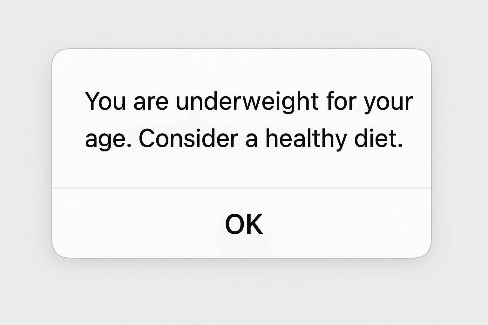
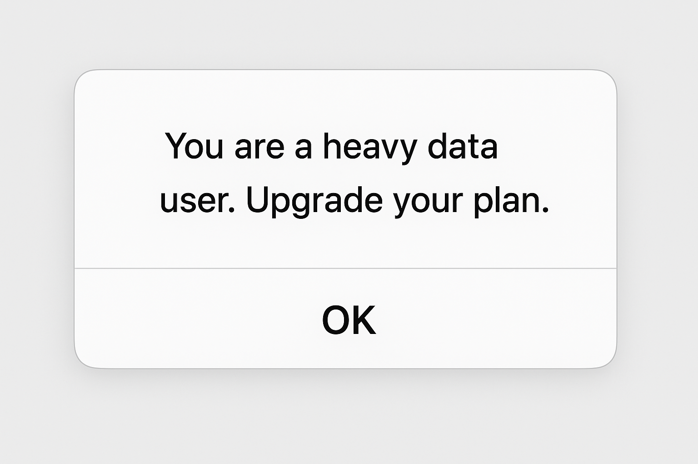
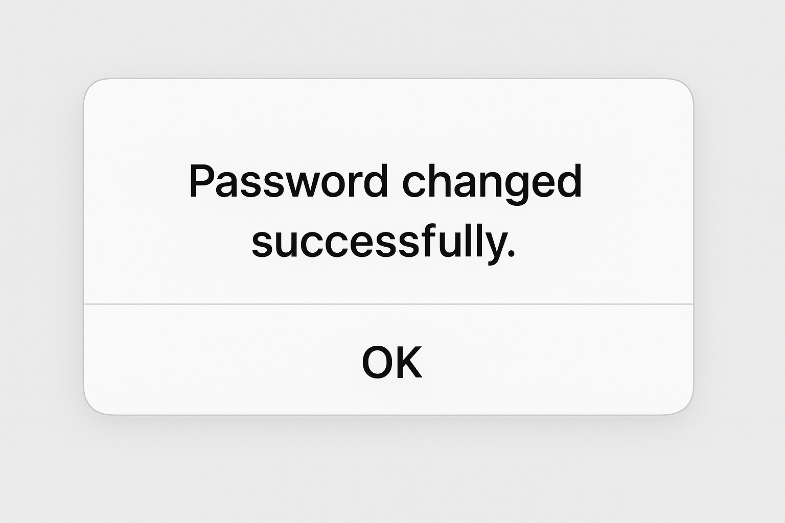

# Smart Life Assistant

## 📌 Project Overview
Smart Life Assistant is a JavaScript-based interactive console/web app that helps users with:
1. 🏃‍♂️ Fitness suggestions based on age and weight
2. 💸 Monthly budget planning
3. 📱 Mobile data usage alerts
4. 🔐 Password change validation

The application uses `prompt()` to get user input and `alert()` to display useful suggestions and validations.

---

## 🧩 Features

### 1. Fitness Suggestion System
- Input: Age and Weight
- Suggests whether you are fit, underweight, or overweight for your age group.

### 2. Monthly Budget Planner
- Input: Monthly income
- Suggests whether to save, maintain a balanced budget, or invest.

### 3. Mobile Data Usage Alert
- Input: Monthly data usage in GB
- Suggests if usage is low, normal, or heavy.

### 4. Change Password Logic
- Input: Old password, new password, and confirmation.
- Validates old password and checks if new passwords match.

---

## 📷 Screenshots

### Fitness Suggestion


### Monthly Budget Planner


### Mobile Data Usage Alert


### Change Password


---

## 🚀 How to Run
1. Download the repository or clone it:
   ```bash
   git clone https://github.com/YOUR_USERNAME/smart-life-assistant.git
